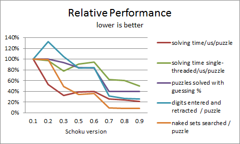

# Schoku: A high speed Sudoku solver

This program couldn't exist without the contribution of user [Mirage](https://codegolf.stackexchange.com/users/106606/mirage) on
the [Code Golf](https://codegolf.stackexchange.com/) site a fair while ago.

It was at that time recognized as a very fast Sudoku solver, written in C.  
I was impressed by the the principled economy of lines of code and solving approaches.  
Over time I made a number of significant improvements to the original code, which is here
still accessible as version 0.1 of Schoku.

This repository represents a plausible and logical line of evolution of that program.

### Abstract
By direct comparison on my test computer, I found that my fastest version of Schoku
runs up to 4 times faster than the original (internal clock measurement, multi-threaded).
In single-threaded mode the factor is much smaller at 1.74, due to the original program's
low multi-threading performance.  
When measuring using the time command, the factors are reduced substantially on
a 17-clue puzzle file with 49151 puzzles, where the startup uses more than 40% of the execution time.

### Summary of Changes
Looking at speed improvements in terms of low hanging fruit, I found that the malloc'ation of the GridState
structures did take up too much time and replaced it by fixed stacks allocated by each thread only once.  
I later learned that the allocation and placement of the GridState data affected primarily the multi-threading performance.  
The hidden single search allowed for removal of repeating calculations, which offered a welcome boost.  I also made the search cover all hidden singles.  
I pruned the naked set search to skip already found sets and not to look at sets that provide no benefit, e.g. sets covering all of the available cells (N or N-1).  
The guessing code did search all cells, even though it could simply pick the first cell with 2 candidates found.  
Throughout, I also added lookup tables where they were useful.  
Then I integrated the entering loop (for solved cells) with the search for the next naked single.  This unfortunately involved some additional spaghetti coding techniques in form of labels and gotos.  
I also changed the program to use memory mapped I/O (this relieves the main thread from doing nearly any computations or I/O.  
Later I implemented a triad algorithm that finds and removes per triad candidates that are impossible.  
The default bi-value guessing strategy is suboptimal, as it searches guesses by preference always beginning in the same area and picks too easily pairs of bi-values that depend on each other and little else.  
This causes the tree of guesses to grow unnecessarily.  
I used an approach that pays off by reducing the overall number of guesses.  The key is to find 'balanced' guesses that bisect the set of possible paths.

### What to measure
The program self-measures accurately internally the execution time of the program
minus the loading and startup sequence and the final reporting.  This approach is
precise and justifiable.  
The startup of this program on a specific OS may vary,
But I found on Cygwin64 the overhead to be very close to 20ms.  
The time command reported timing varies quite a bit while the internal timings were more stable.  
I elected to collect statistics based on the multi-threaded timings througout.  
For the later versions of Schoku the factor between multi-threading and single-threading is close to 6
for a 4 CPU / 8 execution units processor.  
The original code's ratio of multi- to single-threaded performance started very low at 2.15 and improved with the allocation and alignment
of the grid state data.

I am taking timings on a Zen2 Ryzen 7 4800U processor.

### Approach
For a cell-based Sudoku solver, the order of business is the same as for human users:
- remove any 'pencil' marks related to the last solved digit and cell
- find a naked single,  enter it and repeat from the beginning
- find a hidden single, enter it and repeat from the beginning

Iterestingly, for the programmer as well as the human player, the next step is not
obvious at all.  It goes as follows:
- look at triads (three cells in the intersection of a row or column with a box)
- check whether any of the candidates present in the triad are _not_ present in
  either: the rest of the row/column _or_ the rest of the box (these are the 'peers' of the triad).
- if there are, these candidates cannot be present in any of the cells of _all_ the peers;
  they can therefore be removed.

This technique is often stated to human solvers as 'pointing candidates' with the variants pointing and claiming,
which is exactly the same thing.  
Mathematically it is as simple as the intersection of two (unique) sets;
what is in the intersection cannot be also outside.

With that out of the way, these triads have another property: If a triad has exactly
3 candidates, then this cannot change, regardless of whether any of the cells have been
resolved or not.  This is sufficient to remove this set of 3 candidates from all the peers
of the triad. Note that this is a particular form of set, which can be detected more
easily than other sets.

- after removing the candidates thus discovered by looking at triads, repeat from the beginning.

But we are not done yet:
- look for naked sets (as set of N cells that overall contains exactly N candidates and
  no other candidates) in any row, column or box.

Really any size is possible, a naked set of 1 being a naked single, and a naked set of 9 filling
all of the row.

* consequences of finding a naked set:
..* no other cell in that section can contain these N candidates.
  This leaves us with another set (the complementary set).
..* the complementary set cells can therefore be purged of the N candidates found.
  The complementary set is usually a hidden set. 

* once more, after removing the extra candidates from the hidden set, repeat from the beginning.

With these 4 algorithms, we have covered the basics.

- if none of them were successful, the next and crucial step is to guess a candidate.
  and repeat from the beginning.

What else?  A lot.

### Performance
- SIMD (vectorization) offers an opportunity to execute 8 or 16 times the operations
  if and only if we can line up the data and the operations just right.
- multi-threading offers an opportunity to execute the essential portion of the program
  in parallel 8 or 12 times on different puzzles.  Again, ensuring that everything is
  just ideally set up is crucial.

### The puzzles
There are different difficulty levels at which the program operates.
- Some puzzles are quickly solved without even guessing once.
- Others are specially selected or even constructed to defeat the simple algorithms
  we throw at them.  By guessing we have to drill down to a level where the puzzles
  offers more information to those algorithms.
- If the collecion of puzzles is biased one way or the other, different choices
  in the program influence the performance.

Many other details will play a role.  The order and implementation of the algorithms is 
obviously a factor and it is hard to tell which decisions impact the larger picture.  
It is relatively simple to leave out some of the parts above and still achieve good performance.
In fact, incorrect or suboptimal implementations often do not result in performance
degradation but rather in changes of one statistic or another.

There are additional algorithms that may be beneficial, in fact some are implemented
here.  
End-game algorithms, guessing algorithms, algorithms that will assume there
is a unique solution and based on just that knowledge, detect candidates that cannot
be part of the solution without causing multiple solutions, which goes against the assumption.

### Why choose that very specific program as a starting point? 

Because it incorporates, in a very concise way, the basic cornerstones of a very fast
Sudoku solver: naked and hidden single search, naked set search and guesses.
Implemented convincingly with SIMD instructions and multi-threading.

The study of this program revealed opportunities for sure.  But the way it was written
also provided an excellent basis for demonstrating the improvements.

Last but not least, the present program offers a full range of options that
the original did not posses, possibly because it was meant as a demonstration or
for instructional purposes.

To name a few:
- optional trace/debugging facilities to provide the step by step decision making process.
- options to prove uniqueness and verify the solutions
- an option to check the puzzle
- options to control the number of threads
- optionally provde statistics and timing information
- optionally solve a single puzzle from a puzzle file

Also, some adaptivity is welcome, e.g. when faster and/or specialized instructions
may or may not be available.

### What does this program not achieve:
- __portability__  
  Neither the processor nor even the generation of processor are a choice of the
  user. The program requires the AVX2 instruction set and several instructions that
  are present in those processors that have AVX2.  
  The compiler required is gcc/g++.  
  I found that the original program was in a strange way owing to a function created by
  Microsoft and ported to gcc, where it is nigh impossible to use it in portable
  fashion on version of gcc that implements long int as 64 bit.  
  That is the reason why version 0 of the programs does not compile/work on Cygwin64 as is.
- __structured programming__  
  Honestly, the solving function is an order of magnitude too long and uses labels/gotos.
- __pure C++__  
  While using many features of C++, the code is also in no way pure C++ and does in many
  places not follow best practice when it comes to solving performance issues.
  For example, unions are used throguhout to imply/suggest simple operations
  based on overloaded data types. This relies heavily on the precise layout of
  memory and endianness.
- __ease of debugging__  
  Luckily gcc has a performant optimizer.  Unfortunately the same optimizer makes it
  extremely hard to debug this program (AVX2 data types, passing 32-byte aligned
  data on the stack and just plain unwillingness to stop a crucial lines).
  Not to mention that Cygwin can be a development environment, but not a flexible
  or powerful one.  The Linux compatibility has limits.  Performance is not
  guaranteed to be on a par 1-1.
- I would have preferred a way to portably leverage AVX capable processors.  
  E.g. using Agner Fog's VCL, which I have used for training wheels.
  That will have to wait for another time. 

